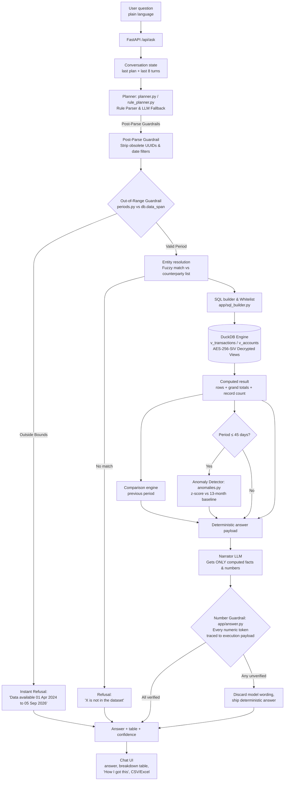
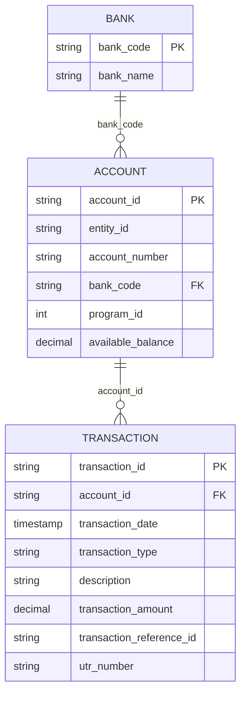

# Finance Assistant — architecture

## 1. Request flow

## 2. Why the LLM never touches a number

| Stage | Who does it | Why |
| --- | --- | --- |
| Understand the question | LLM (3B) | Language is what models are good at. |
| Choose dataset, filters, grouping, period | LLM, constrained to a JSON schema | The output space is tiny and validatable. |
| Resolve dates | Python (`app/periods.py`) | `last month` must be exact, not "probably August". |
| Resolve counterparty / enum names | RapidFuzz vs the real counterparty list | The model cannot invent a payee. |
| Build SQL | Python (`app/sql_builder.py`) | Identifiers come from a whitelist, literals are bound parameters. |
| Filter, group, aggregate | DuckDB | Arithmetic is exact and reproducible. |
| Phrase the answer | LLM (3B) | Only reads pre-computed facts. |
| Publish the answer | Number guardrail (`app/answer.py`) | Any digit not traceable to the result set is rejected. |

## 3. Grounding invariants

1. **Whitelist-only SQL.** `app/schema_catalog.py` is the single source of truth. A field the model invents is stripped by the validator before SQL is built, and the correction is shown to the user.
2. **No literal interpolation.** Every value is a bound parameter. This also removes SQL injection as a class of bug.
3. **Read-only database.** The DuckDB connection is opened with `read_only=True`.
4. **Sensitive columns are unreachable.** `account_number` and `utr_number` are not in the catalog at all — the views expose only a masked account number, and the UTR never leaves the database even if the model asks for it.
5. **Deterministic answer always exists.** The templated answer is generated from the SQL result before the LLM is called; the model's wording is an optional upgrade, never a dependency.
6. **Verify before display.** Numeric tokens in the model's wording are parsed (including `₹`, `,`, `%`, `k`/`M` suffixes) and matched against every value in the result set, grand totals, comparison figures and the user's own numbers, within a 0.5 % tolerance. One mismatch discards the whole sentence.
7. **Refuse rather than approximate.** Unknown counterparty, unsupported question, forward-looking question or zero matching rows all produce an explicit "there is no figure to report" answer.

## 4. Components

| Path | Responsibility |
| --- | --- |
| `app/schema_catalog.py` | Datasets, fields, enums, allowed aggregations/operators. Drives prompt + validation. |
| `app/derivations.py` | Counterparty, channel, reconciliation and masking SQL — the derived layer. |
| `app/views.py` | Builds `v_transactions` / `v_accounts` with AES-256-SIV deterministic encryption for PII fields. |
| `app/plan_models.py` | Pydantic `QueryPlan` — the structured AST interface between intent and execution. |
| `app/planner.py` | Dual-engine intent planner (rule parser + LLM), post-parse guardrails & entity resolution. |
| `app/periods.py` | Symbolic period → concrete date range, dataset date bounds validation. |
| `app/sql_builder.py` | Plan → parameterised SQL with strict schema whitelist. |
| `app/executor.py` | Runs the query in DuckDB, grand totals, comparison, supporting records. |
| `app/anomalies.py` | Pure SQL z-score anomaly detector against 13-month trailing baseline (for periods ≤45 days). |
| `app/answer.py` | Deterministic answer, LLM narration, strict number verification guardrail. |
| `app/engine.py` | Main orchestration, out-of-range date guardrails, refusals, multi-turn session state. |
| `app/main.py` | FastAPI endpoints + static chat UI + CSV/Excel export. |
| `web/` | Zero-build chat UI (no CDN, works offline). |
| `evals/` | Ground-truth benchmark: NL answer vs SQL executed directly. |

## 5. Data model

The provided schema, unchanged:

Queries run against two flattened views so the plan schema stays flat and joins never depend on the model:

| View | Built from | Notes |
| --- | --- | --- |
| `v_transactions` | `txn_enriched` + `account` + `bank` | adds `counterparty`, `channel`, `reconciliation_status`, `account_number_masked` |
| `v_accounts` | `account` + `bank` | balances; no date column, so time filters are rejected with an explanation |

### Derived fields, and why

The schema has no counterparty column and no reconciliation column, but both are core to the brief. Rather than invent data, each is derived from real columns with one shared, documented definition (`app/derivations.py`):

| Field | Definition | Surfaced as |
| --- | --- | --- |
| `counterparty` | Longest run of capitalised words in `description`, after removing rail/bank noise tokens. Spelling variants (`SELECTION MOBILE` / `SELECTIONMOBILE`) are folded onto one canonical name. | "Counterparty names are parsed out of the free-text bank narration." |
| `channel` | Rail detected from the narration prefix: UPI / NEFT / IMPS / RTGS / FT / CHEQUE / ACH / ATM / CHARGES. | shown as a normal field |
| `reconciliation_status` | `reconciled` when the row carries a `transaction_reference_id` **or** a `utr_number`; `unreconciled` when it carries neither. | Stated in the answer's assumptions every time it is filtered. |
| `account_number_masked` | `XXXXXX` + last 4 digits. | the raw column is not in the catalog at all |

The reference-vs-UTR question the schema doc raises is answered explicitly: a bare "reference number" hits `transaction_reference_id`, the plaintext searchable column. `utr_number` is never exposed or queried.

## 6. Scale — measured, not claimed

Built at the stated 20 M-record test limit with `--transactions 20000000` and benchmarked with `python scripts/benchmark.py --db data/scale20m.duckdb`:

| | 20,000,000 transactions |
| --- | --- |
| Database file | 3.89 GB |
| One-off build (generate + derive + index) | 409 s |
| Total spend, one month | 46 ms |
| Top counterparties, YTD | 145 ms |
| Unreconciled, all time | 57 ms |
| Monthly trend, full history | 387 ms |
| One counterparty, one month | 26 ms |
| **End-to-end, question to answer** | **401 ms average over the 20-question benchmark** |
| Accuracy at 20 M | 20/20, unchanged from 250 k |

Why it holds up:

- Queries are vectorised scans over 2-3 columns with a date predicate — the best case for a columnar engine.
- The expensive part, regex parsing of narrations, happens **once at load** into `txn_enriched`, never per query.
- Ungrouped aggregates skip the redundant grand-total query: the main query already is the total.
- The underlying-record sample is a top-N sort, the single most expensive query in the pipeline. It is fetched **on demand** via `/api/records` when the explain panel is opened, not on the answer path. That alone took the 20 M end-to-end average from 1,237 ms to 401 ms.
- Indexes on `transaction_date` and `counterparty`.

DuckDB itself is nowhere near its limit at 20 M — it is designed to work beyond RAM and handles far larger tables. The constraint here is the shape of the queries, and that has been tuned.
