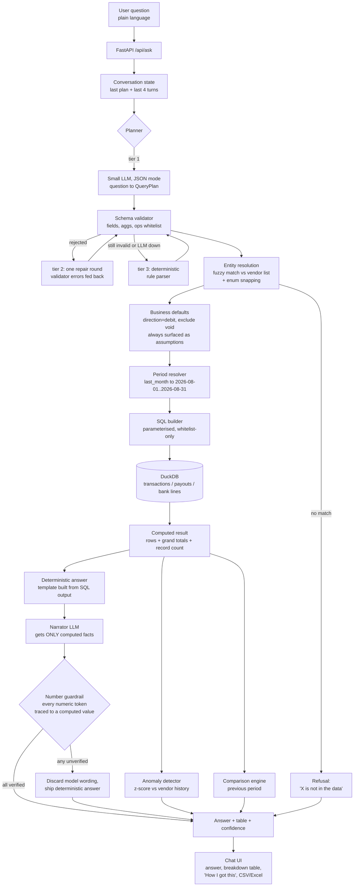
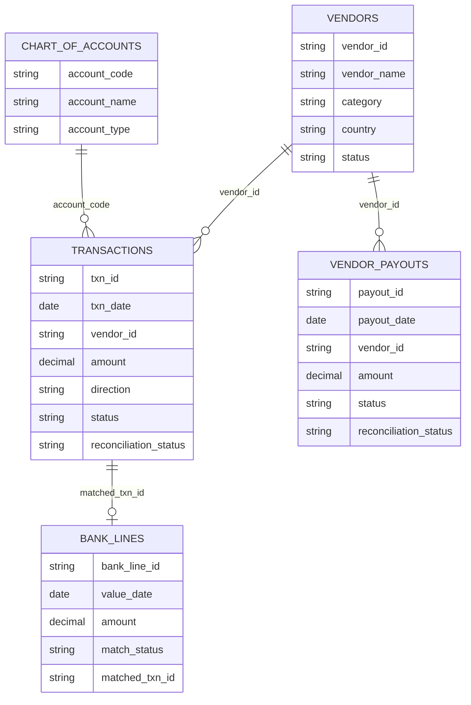

# Finance Assistant — architecture

## 1. Request flow

## 2. Why the LLM never touches a number

| Stage | Who does it | Why |
| --- | --- | --- |
| Understand the question | LLM (3B) | Language is what models are good at. |
| Choose dataset, filters, grouping, period | LLM, constrained to a JSON schema | The output space is tiny and validatable. |
| Resolve dates | Python (`app/periods.py`) | `last month` must be exact, not "probably August". |
| Resolve vendor / enum names | RapidFuzz vs the real vendor table | The model cannot invent a counterparty. |
| Build SQL | Python (`app/sql_builder.py`) | Identifiers come from a whitelist, literals are bound parameters. |
| Filter, group, aggregate | DuckDB | Arithmetic is exact and reproducible. |
| Phrase the answer | LLM (3B) | Only reads pre-computed facts. |
| Publish the answer | Number guardrail (`app/answer.py`) | Any digit not traceable to the result set is rejected. |

## 3. Grounding invariants

1. **Whitelist-only SQL.** `schema_catalog.py` is the single source of truth. A field the model invents is stripped by the validator before SQL is built, and the correction is shown to the user.
2. **No literal interpolation.** Every value is a bound parameter. This also removes SQL injection as a class of bug.
3. **Read-only database.** The DuckDB connection is opened with `read_only=True`.
4. **Deterministic answer always exists.** The templated answer is generated from the SQL result before the LLM is called; the model's wording is an optional upgrade, never a dependency.
5. **Verify before display.** Numeric tokens in the model's wording are parsed (including `$`, `,`, `%`, `k`/`M` suffixes) and matched against every value in the result set, grand totals, comparison figures and the user's own numbers, within a 0.5 % tolerance. One mismatch discards the whole sentence.
6. **Refuse rather than approximate.** Unknown vendor, unsupported question, forward-looking question or zero matching rows all produce an explicit "there is no figure to report" answer.

## 4. Components

| Path | Responsibility |
| --- | --- |
| `app/schema_catalog.py` | Datasets, fields, enums, allowed aggregations/operators. Drives prompt + validation. |
| `app/plan_models.py` | Pydantic `QueryPlan` — the only interface the LLM has to the data. |
| `app/planner.py` | 3-tier NL → plan, entity resolution, business assumptions. |
| `app/periods.py` | Symbolic period → concrete date range, and previous-period arithmetic. |
| `app/sql_builder.py` | Plan → parameterised SQL. |
| `app/executor.py` | Runs the query, grand totals, comparison, supporting records. |
| `app/anomalies.py` | z-score call-outs against each vendor's trailing 12-month history. |
| `app/answer.py` | Deterministic answer, narration, number guardrail, confidence scoring. |
| `app/engine.py` | Orchestration, refusals, multi-turn session state. |
| `app/main.py` | FastAPI endpoints + static chat UI + CSV/Excel export. |
| `web/` | Zero-build chat UI (no CDN, works offline). |
| `evals/` | Ground-truth benchmark: NL answer vs SQL executed directly. |

## 5. Data model

Queries run against three flattened views (`v_transactions`, `v_vendor_payouts`, `v_bank_lines`) so the plan schema stays flat and joins never depend on the model.

## 6. Scale

DuckDB is columnar and vectorised; the aggregate queries used here are scans with a date predicate. The prototype ships with 250 k transactions and regenerates to 20 M with one flag (`--transactions 20000000`), with sub-second aggregates on a laptop. Date and vendor indexes are created at build time.
